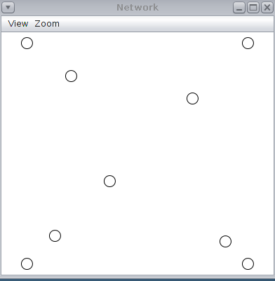
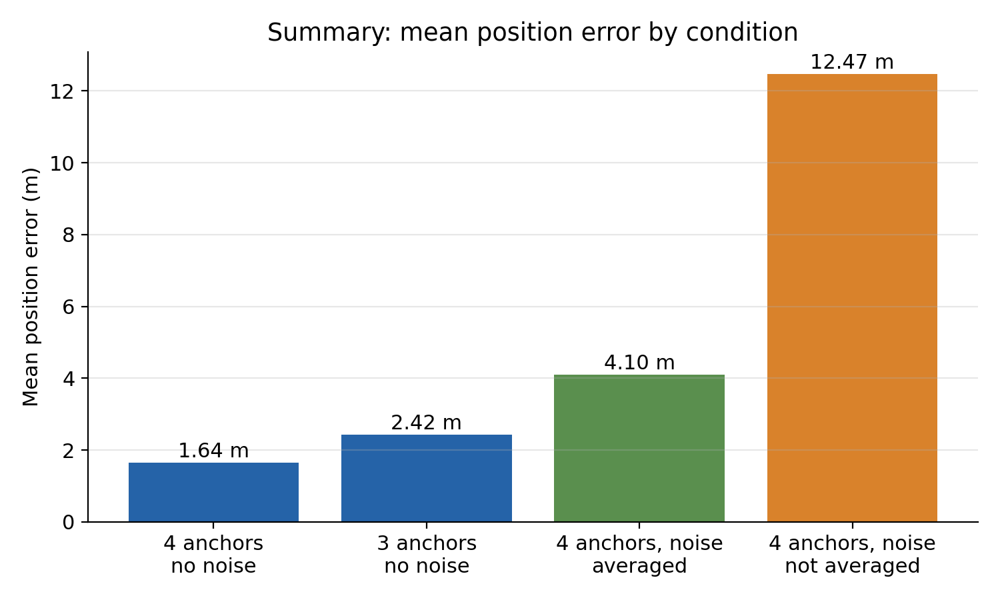

# RSSI-Based Range Localization Using Trilateration in WSN

**Accuracy analysis in Cooja (Contiki)**

A simulated wireless sensor network in which nodes determine their own location without GPS. A few sensors with known positions (anchors) broadcast signals, and the remaining sensors (unknown nodes) use signal strength to estimate their distance to each anchor, then combine those distances to pinpoint their position. Tested in the Cooja network simulator on a 40 m x 40 m field, the system located nodes to within about 1.6 m, and averaging repeated readings reduced error by roughly two-thirds under noisy conditions.

> Simulation only. No real hardware was used.

---

## Table of Contents

1. [Highlights](#highlights)
2. [How It Works](#how-it-works)
3. [Network Layout](#network-layout)
4. [Repository Structure](#repository-structure)
5. [Environment](#environment)
6. [Configuration Switches](#configuration-switches)
7. [How to Run](#how-to-run)
8. [Output Format](#output-format)
9. [Calibration](#calibration)
10. [Experiments and Results](#experiments-and-results)
11. [Observations](#observations)
12. [Design Decisions](#design-decisions)
13. [Troubleshooting](#troubleshooting)
14. [Limitations](#limitations)
15. [Future Work](#future-work)
16. [Author](#author)

---

## Highlights

- **1.64 m** mean position error with 4 anchors and no noise.
- **2.42 m** mean position error with 3 anchors and no noise.
- With 2 dB injected noise, **averaging RSSI readings reduced error from 12.47 m to 4.10 m** (about 67%).
- Nodes near the edge of the field were less accurate than the node near the centre.
- Entirely in embedded C on Contiki, with a least-squares position solver running on the mote itself.

---

## How It Works

### 1. Anchors broadcast

Four anchor motes know their own coordinates. Every 1 to 2 seconds each anchor sends a Rime broadcast (channel 129) containing:

```
{ id, x, y }
```

### 2. Unknown nodes measure RSSI

When an unknown node receives an anchor packet, it reads the Received Signal Strength Indicator (RSSI) of that packet. Depending on the `AVG` switch, it either keeps the last reading or averages the readings collected from each anchor.

### 3. RSSI to distance

Distance is estimated with the log-distance path-loss model:

```
RSSI(d) = RSSI0 - 10 * n * log10(d)
```

Solving for distance:

```
d = 10 ^ ((RSSI0 - RSSI) / (10 * n))
```

where `RSSI0` is the RSSI at 1 m and `n` is the path-loss exponent. Both were calibrated from 20 readings (see [Calibration](#calibration)).

### 4. Position by least squares

For anchors `i = 1..N` at `(xi, yi)` with estimated distances `di`, the unknown position `(x, y)` satisfies

```
(x - xi)^2 + (y - yi)^2 = di^2
```

Subtracting the equation of anchor 1 from the others removes the quadratic terms and gives a linear system:

```
2(xi - x1) * x + 2(yi - y1) * y = d1^2 - di^2 + xi^2 - x1^2 + yi^2 - y1^2      for i = 2..N
```

Written as `A p = b` with `p = [x, y]^T`, the least-squares solution is

```
p = (A^T A)^-1 A^T b
```

Since `A^T A` is only 2x2, it can be inverted directly in C on the mote. With 3 anchors the system is exactly determined (2 equations, 2 unknowns); with 4 anchors it is overdetermined, so noise is partly averaged out.

### 5. Reporting

Every 10 seconds each unknown node prints its estimate:

```
P,<id>,<x in cm>,<y in cm>
```

Coordinates are printed in centimetres (integers) to avoid floating-point printing on the Sky mote.

---

## Network Layout

All coordinates are in metres on a 40 m x 40 m field.

| Role | Node ID | Position (x, y) |
|---|---|---|
| Anchor | 1 | (0, 0) |
| Anchor | 2 | (40, 0) |
| Anchor | 3 | (0, 40) |
| Anchor | 4 | (40, 40) |
| Unknown | 6 | (15, 25) |
| Unknown | 7 | (8, 6) |
| Unknown | 8 | (30, 10) |
| Unknown | 9 | (5, 35) |
| Unknown | 10 | (36, 36) |

```
 y
40 |  A3(0,40)                       A4(40,40)
   |      U9(5,35)           U10(36,36)
   |
   |              U6(15,25)
   |
   |                      U8(30,10)
   |   U7(8,6)
 0 |  A1(0,0)                        A2(40,0)
   +------------------------------------------- x
   0                                          40
```

*Replace the sketch above with `images/layout.png` once the diagram is exported.*



---

## Environment

| Component | Version / Choice |
|---|---|
| OS image | Instant Contiki 3.0 (Ubuntu 12.04, 32-bit) |
| Virtualisation | VMware Workstation 17 Player |
| Simulator | Cooja |
| Mote type | Sky mote |
| Radio medium | MRM (Multi-path Ray-tracer Medium) |
| Communication stack | Rime, broadcast on channel 129 |
| Language | C (Contiki) |
| Extra library | `libm` (`-lm`) for `log10` and `pow` |

---

## Configuration Switches

All switches are `#define`s at the top of `unknown.c`.

| Switch | Meaning | Values used |
|---|---|---|
| `NA` | Number of anchors used in the solver | `3` or `4` |
| `AVG` | `1` = average the RSSI readings per anchor, `0` = use only the last reading | `0`, `1` |
| `SIGMA` | Standard deviation of the noise (dB) added to RSSI in code | `0`, `2` |
| `RSSI0` | Calibrated RSSI at 1 m (dBm) | `-40.4` |
| `PLE` | Calibrated path-loss exponent `n` | `1.96` |

Recompile after changing any switch.

---

## How to Run

### 1. Copy the project into Contiki

The simulation file refers to Contiki paths, so the project must live inside the Contiki tree.

```bash
cp -r src ~/contiki/examples/wsn-rssi
cd ~/contiki/examples/wsn-rssi
```

### 2. Check the Makefile

```make
CONTIKI_PROJECT = anchor unknown
all: $(CONTIKI_PROJECT)

CONTIKI_WITH_RIME = 1
TARGET_LIBFILES += -lm

CONTIKI = ../..
include $(CONTIKI)/Makefile.include
```

### 3. Build

```bash
make TARGET=sky
```

This produces `anchor.sky` and `unknown.sky`.

### 4. Start Cooja

```bash
cd ~/contiki/tools/cooja
ant run
```

### 5. Open the simulation

`File > Open simulation > Browse...` and select `~/contiki/examples/wsn-rssi/rssi.csc`.

The `.csc` file stores the mote types and the exact positions of all nine motes.

### 6. Run and record output

1. Open the **Mote output** window (Tools menu).
2. Press **Start** in the Simulation control window.
3. Let it run. For noisy runs, a longer duration gives more estimates per node.
4. Filter the output for lines starting with `P,` and save them to a text file under `data/`.

### Building the layout from scratch (optional)

If you need to recreate the layout rather than open `rssi.csc`: set the radio medium to MRM, add one mote at a time (anchors with IDs 1 to 4 from `anchor.sky`, unknown nodes with IDs 6 to 10 from `unknown.sky`), and set each position from the table above.

---

## Output Format

Each estimate is one line:

```
P,<node id>,<x in cm>,<y in cm>
```

Example (illustrative format only):

```
P,6,1523,2478
```

means node 6 estimates its position at x = 15.23 m, y = 24.78 m. Position error for an estimate is the Euclidean distance to the node's true position from the [layout table](#network-layout). Mean position error is averaged over all estimates from all unknown nodes in a run.

---

## Calibration

Before running the localization experiments, the path-loss model was calibrated from **20 RSSI readings** collected at known distances in the MRM environment. Fitting `RSSI(d) = RSSI0 - 10 * n * log10(d)` gave:

| Parameter | Value |
|---|---|
| `RSSI0` | -40.4 dBm |
| `n` (path-loss exponent) | 1.96 |

An exponent near 2 is consistent with free-space propagation. The raw readings are in `data/calibration_readings.txt`.

---

## Experiments and Results

Four configurations were run on the same layout.

| # | Anchors | Noise (`SIGMA`) | RSSI averaging | Mean position error |
|---|---|---|---|---|
| 1 | 4 | none | n/a | **1.64 m** |
| 2 | 3 | none | n/a | **2.42 m** |
| 3 | 4 | 2 dB | averaged | **4.10 m** |
| 4 | 4 | 2 dB | last reading only | **12.47 m** |

Key comparisons:

- **Anchor count:** going from 3 to 4 anchors lowered mean error from 2.42 m to 1.64 m, because the extra equation makes the system overdetermined and partly cancels ranging errors.
- **Averaging:** under 2 dB noise, averaging reduced mean error from 12.47 m to 4.10 m, a reduction of about 67%.
- **Cost of noise:** even with averaging, noise raised error from 1.64 m to 4.10 m, so averaging recovers much but not all of the accuracy.

Graphs and per-node tables are in `data/results_summary.xlsx` and `images/error_graphs.png`.



---

## Observations

1. **Position matters.** The edge nodes (ID 9 and ID 10) had higher error than the central node (ID 6). Near the field boundary, the anchor geometry is less favourable and distance errors translate into larger position errors, and far anchors give weaker RSSI where small dB changes correspond to large distance changes.
2. **RSSI is an integer.** The radio reports RSSI in 1 dB steps. Because distance depends exponentially on RSSI, this rounding produces systematic artefacts in the distance estimates that do not average out.
3. **Distance sensitivity grows with range.** With the path-loss model, a fixed dB error causes a larger distance error at long range than at short range.
4. **Averaging is highly effective against zero-mean noise,** which is why it gave the largest improvement of anything tested.

---

## Design Decisions

| Decision | Reason |
|---|---|
| MRM instead of UDGM | UDGM gives near-constant RSSI, which makes distance estimation trivial and unrealistic. MRM produces distance-dependent RSSI. |
| Rime broadcast | Lightweight, built into Contiki, and sufficient for one-hop anchor beacons. |
| Linear least squares (subtract anchor 1) | Turns the nonlinear circle equations into a small linear system that is cheap enough to solve on a Sky mote. |
| Integer centimetre output | Avoids printing floats on the mote. |
| Noise injected in code | MRM alone gave too little variation to study noise, so a controllable `SIGMA` was added. A bug in this step was fixed with an `(int)` cast. |
| Compile-time switches | Keeps the firmware simple and each experiment reproducible by editing one line. |

---

## Troubleshooting

Issues encountered while setting up the project, and their fixes.

| Problem | Fix |
|---|---|
| VM has no network | The VMware NAT service was disabled. Start the *VMware NAT Service* in Windows services. |
| Build fails with missing MSPSim | The MSPSim submodule was not fetched. Run `git submodule update --init` in the Contiki directory (SSL certificate checking had to be turned off on the old VM image for this). |
| Linker error for `log10` / `pow` | Add `TARGET_LIBFILES += -lm` to the Makefile. |
| Rime functions undefined | Add `CONTIKI_WITH_RIME = 1` to the Makefile. |
| Motes land at wrong positions | Positions are easiest to set by adding one mote at a time and entering coordinates, or by opening `rssi.csc`. |
| Constant RSSI everywhere | The radio medium is UDGM. Switch to MRM. |
| Noise has no effect or behaves oddly | Make sure the noise value is cast to `int` before being added to the integer RSSI. |
| `.csc` cannot find `anchor.c` | The project must be located at `~/contiki/examples/wsn-rssi` so that the `[CONTIKI_DIR]`-relative paths resolve. |

---

## Limitations

- **Simulation only.** No real radios, antennas, or environments were tested.
- **Noise is synthetic.** It is injected in code (uniform, controlled by `SIGMA`, 2 dB used) rather than produced by the MRM radio model, so it does not capture real-world effects such as shadowing, multipath fading, or interference.
- **Small experiment.** Five unknown nodes, a single layout, and 5 to 6 position estimates per node in each noisy run. This is too few for strong statistical claims or percentile metrics.
- **One noise level.** Only 2 dB was tested.
- **No obstacles.** The field is open; there are no walls or other obstructions, so this is range-based localization in an idealised space, not an indoor localization system.
- **Static nodes.** Unknown nodes do not move.

---

## Future Work

- **More anchors:** test 5 or more anchors and non-corner arrangements.
- **Anchor geometry analysis:** compare corners vs. line vs. clustered layouts, not only the number of anchors.
- **Other noise levels:** for example `SIGMA = 4`, and plot error against sigma.
- **More RSSI filtering:** median filter and Kalman filter alongside the moving average.
- **Weighted least squares:** give nearer or stronger-signal anchors more weight (for example `1/d^2`).
- **Adaptive anchor selection:** use only the strongest or nearest anchors instead of all of them.
- **More positions and longer runs:** more unknown nodes and more estimates per node, enabling RMSE, standard deviation, and percentile error.
- **Obstacles and changing conditions:** use MRM obstacles to study their effect on RSSI and accuracy.
- **Mobile nodes:** track a moving node's estimated position over time.
- **Machine-learning localization:** predict `(x, y)` directly from RSSI vectors and compare with trilateration.
- **Real hardware:** validate on physical Contiki-compatible nodes and compare Cooja results with real measurements.

---

## Acknowledgements

- [Contiki OS](https://github.com/contiki-os/contiki) and the Cooja simulator.
- Course: Wireless Sensor Networks (21CSE459T), SRMIST.